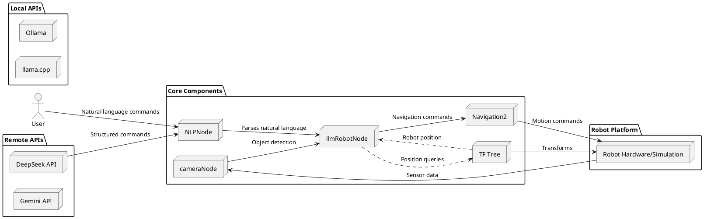
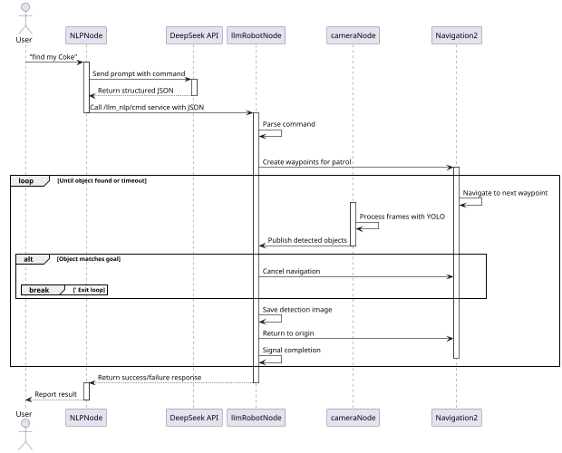
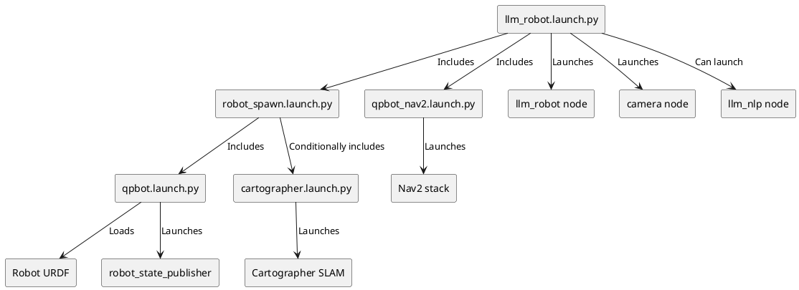

# demo
Powered By Slidev

<div class="abs-br m-6 text-xl">
  <a href="https://github.com/lalafua/sim_llm" target="_blank" class="slidev-icon-btn">
    <carbon:logo-github />
  </a>
</div>

---
transition: slide-left
level: 1
---

## 项目简介

<br>

`sim_llm` 是一个基于 `ROS2` 的仿真 `demo` ，旨在验证大预言模型在驱动机器人任务规划，以完成给定一系列自然语言目标的复杂任务的能力。尽管本人能力有限，目前只实现了一个简单的任务，跟真正的 `AI Powered Robot` 还有很远的距离，但是在实现的过程中仍然展现出 `AI` 在驱动机器人方面巨大的潜力。

<div class="flex justify-center items-center space-x-4">
  
  
</div>

---
transition: slide-left
level: 1
---

## 目录

<br>

<Toc text-lg minDepth="1" maxDepth="2" />

---
transition: slide-left
layout: center
level: 1
---

## 软件层面

---
transition: slide-left
level: 1
---

## 实现逻辑

<br>




---
transition: slide-left
level: 2
---

### 部分 Prompt

<br>

<div class="flex gap-x-6 items-start">
  <div class="w-1/2">
  Prompt

  ```python
  """
  You are the most accurate command parser! Your task is to transfer information between human and robot.

  CLASS_NAME = (
	  'mask',
	  'phone',
	  'bottle',
	  'gloves',
	  'metal',
	  'palstic bag',
	  'sunglasses',
      'boll',
	  'door',
	  'other',
  )

  # Instructions
  - First, Abstracting actionable words from conversations.
  - Second, Compare the object to the object in CLASS_NAME and choose the word with the closest meaning to replace it.
  - Finally, Generate a json string.
  """
  ```
  </div>

  <div class="w-1/2">
  效果

  ```bash
  $ ros2 run llm_robot llm_nlp
  [INFO] [1747210469.572801722] [llm_nlp]: Node llm_nlp has been created.
  [INFO] [1747210520.712851597] [llm_nlp]: Wait for service '/nlp/nlp_cmd'
  Enter a command: find my Coke.
  {
    "commands": [
      {
        "command": "find",
        "parms": {
          "object": "Coke"
        }
      },
    ]
  }
  ```
  </div>
</div>

---
transition: slide-left
level: 2
---

### 处理指令

<br>

```python
  def parser_map(self, cmd):
    commands = json.loads(cmd)["commands"]
    print(commands) 
    
    command_map = {
      "find": lambda parms : self.find(parms["object"])
    }

    for item in commands:
      command = item["command"]
      parms = item["parms"]
      if command in command_map:
        command_map[command](parms)
      else:
        self.get_logger().error("Command {} not found.".format(command))
```

---
transition: slide-left
level: 2
layout: center
---

### 处理流程



---
transition: slide-left
level: 2
layout: center
---

### ROS Launch 



---
transition: slide-left
level: 3
---

#### llm_robot.launch.py

<br>

这是启动整个系统的主要入口点：
1. 启动核心 ROS2 节点：
	- llm_robot node 用于顶层机器人控制
	- camera node 用于目标检测
	- llm_nlp node 用于自然语言处理
2. include 其他 launch files：
	- robot_spawn.launch.py 初始化 Gazebo 模拟环境并生成机器人
	- qpbot_nav2.launch.py 启动 Navigation2 堆栈


---
transition: slide-left
level: 1
---

## 硬件连接

<br>

受限于目前 Risc-V 开发板较为薄弱的性能与并不完善的生态环境，将本项目完整的部署在 Risc-V 开发板上并且流畅的运行起来并不是一件容易的事情，不过受益于 ROS2 优秀的分布式架构设计，可以很轻松的使用多机通信的方式将项目跑起来。

ROS2 默认的传输层协议为 UDP，这意味着我们只需确保多机之间建立了稳定的网络连接即可。

<div class="flex justify-center items-center space-x-4">
  
</div>

---
transition: slide-left
level: 2
---

### 环境变量设置

通过网线连接宿主机和 LiChee Pi 4A 之后，在两台机子上打开防火墙并设置 `ROS_DOMAIN_ID=<1>`，使用 `Talker Listener` 验证通信情况。

<div class="flex justify-center items-center space-x-4">
  
  
</div>

---
transition: slide-left
level: 1
---

### 运行

<br>

```bash
debian@revyos-lpi4a$ ros2 run llm_robot llm_nlp
```

```bash
xxxxxx@ubuntu2204$ ros2 launch llm_robot llm_robot.launch.py
```

演示视频：[demo_iscas](https://github.com/lalafua/sim_llm/blob/main/assets/demo_iscas.webm)